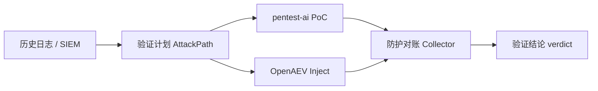

# ChainForge · 无害化攻击链验证 Demo

本地可运行的无害化攻击链验证平台，集成 **pentest-ai + OpenAEV** 双轨执行与 **防护对账**，支持攻击面拓扑上的四阶段动态推演。

**在线仓库**：[github.com/wangdeangela/harmless-chain-demo](https://github.com/wangdeangela/harmless-chain-demo)

## 功能概览

| 能力 | 说明 |
|------|------|
| **验证推演** | 攻击面拓扑 + 日志侧栏，四阶段流水线动态演示（约 90 秒） |
| **双轨执行** | pentest-ai PoC 与 OpenAEV Inject 并行复现，联合判定矩阵 |
| **防护对账** | 120s 窗口核查 WAF/FW 等设备日志，输出对账结论 |
| **场景库** | 内置 6 类攻击场景，当前 **2 个可一键运行** |
| **离线 / 实网** | 支持模拟推演与实网验证两种模式 |

### 四阶段流水线

```
① 日志还原  →  ② 验证计划  →  ③ 双轨复现  →  ④ 防护对账  →  验证结论
```

点击「启动验证」后，系统按上述顺序推演：攻击路径逐跳高亮、日志分类流式写入，**结论在推演结束后才展示**（避免剧透）。

## 快速开始

### 环境要求

- Python **3.9+**
- macOS / Linux（Windows 可手动启动各组件）
- 可选：Docker Desktop（`docker-up.sh`）
- 可选：OpenAEV（`:8888`，实网验证模式）

### 克隆与启动

```bash
git clone https://github.com/wangdeangela/harmless-chain-demo.git
cd harmless-chain-demo

pip install -r portal/requirements.txt
bash scripts/start-graphical-demo.sh
```

浏览器打开 **http://127.0.0.1:8500**，选择场景后点击 **「启动验证」**。

> 若使用 conda，可先 `conda activate <你的环境名>`，脚本会自动尝试激活本地环境，非必须。

### 服务端口

| 服务 | 端口 | 说明 |
|------|------|------|
| 图形化控制台 | 8500 | 主入口 |
| 验证靶场 | 8099 | 无害探针目标 |
| OpenAEV | 8888 | 可选，实网 Inject |

## 控制台导航

| Tab | 功能 |
|-----|------|
| **验证推演** | 拓扑动画、四阶段进度、实时日志、结论摘要 |
| **日志流** | 全量 Mock 日志（SIEM / WAF / FW / 应用 / Audit） |
| **双轨执行** | AttackPath、PoC/Inject 结果、联合判定矩阵 |
| **防护对账** | 对账查询条件、命中记录、对账结论 |
| **场景库** | 内置场景列表与可运行状态 |

## 内置验证场景

| 场景 ID | 名称 | 验证轨道 | 典型结论 |
|---------|------|----------|----------|
| `sqli-waf-demo` | SQL 注入 + WAF | pentest-ai ∥ OpenAEV | 部分成立，有告警未拦截 |
| `apt-lateral-blocked` | APT 横向截断 | OpenAEV | 不成立，防火墙 deny |
| `rce-edr` | RCE + EDR | pentest-ai ∥ OpenAEV | 待接入 |
| `weak-pwd` | 弱口令 | OpenAEV | 待接入 |
| `ransom` | 勒索模拟 | OpenAEV | 待接入 |
| `exfil` | 数据外传 | pentest-ai ∥ OpenAEV | 待接入 |

## 项目结构

```
harmless-chain-demo/
├── portal/           # Web 控制台（Flask + dashboard.html）
├── orchestrator/     # 推演编排、PoC/Inject 调度、裁决逻辑
├── collector/        # 防护对账模拟（120s 窗口查询）
├── target/           # 本地无害验证靶场
├── config/           # 场景配置、拓扑 JSON、Mock 日志
├── scripts/          # 启动脚本
└── docker-compose.yml
```

## 其他启动方式

### Docker 部署

```bash
bash scripts/docker-up.sh
```

> 国内环境拉取 Docker 镜像可能较慢；推荐优先使用 `start-graphical-demo.sh` 本地 Python 运行。

### 命令行离线推演

```bash
bash scripts/run-sim-flow.sh
```

输出 JSON 报告至 `output/` 目录（已被 `.gitignore` 排除）。

## API 端点（简要）

| 方法 | 路径 | 说明 |
|------|------|------|
| GET | `/api/health` | 控制台 / 靶场 / OpenAEV 健康状态 |
| GET | `/api/platform` | 场景与策略配置 |
| GET | `/api/topology/{id}` | 攻击面拓扑 |
| GET | `/api/logs/{id}` | Mock 日志 |
| POST | `/api/run/{id}` | 启动验证（body: `{"mode":"simulated"}`） |

## 架构示意



## 安全说明

- **仅对本地授权靶场**执行无害探针，禁止对未授权目标使用
- 默认授权级别 **L2**，止于 ProofPoint，不做破坏性操作
- 勿将 GitHub Token、内网地址等敏感信息提交到仓库或 Issue

## 更新日志

- **2026-06** — 验证推演页（拓扑 + 日志侧栏）、90s 动态推演、结论延迟展示、防护对账术语统一
